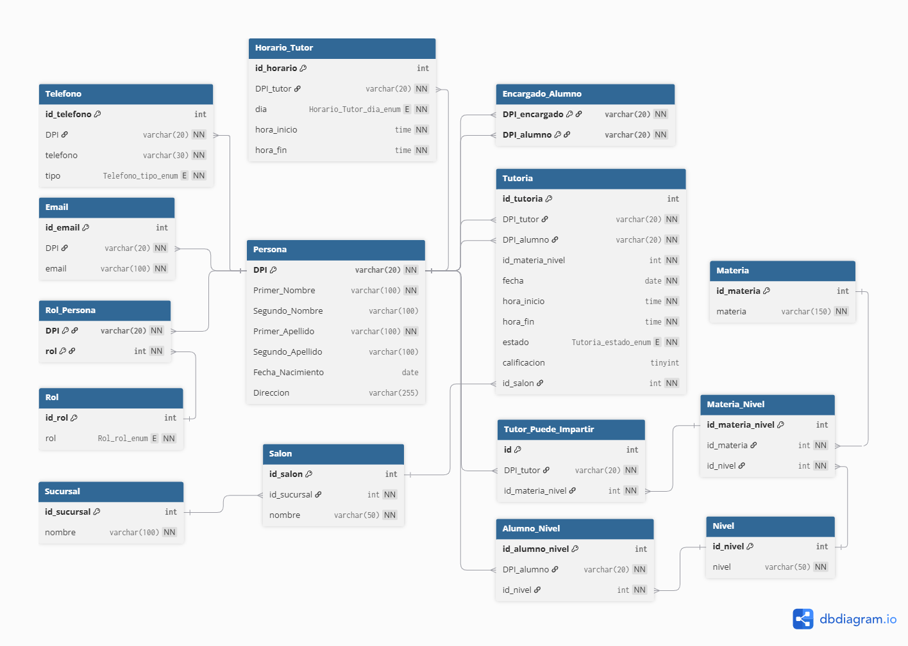

# tutoring-school
# Sistema de Tutorías

Este proyecto contiene el script SQL para la creación de la base de datos **`tutorias`**, diseñada para gestionar información de personas, roles, materias, niveles, tutores, alumnos, tutores legales y asignación de tutorías en un sistema educativo.

## Estructura de la Base de Datos

La base de datos está organizada en las siguientes tablas principales:

- **Persona**: Almacena los datos personales de estudiantes, tutores y encargados.
- **Telefono**: Registra los números de teléfono de cada persona.
- **Email**: Registra los correos electrónicos de cada persona.
- **Rol**: Define los roles posibles (`Estudiante`, `Tutor`, `Encargado`).
- **Rol_Persona**: Relaciona personas con uno o más roles.
- **Materia**: Contiene las materias disponibles.
- **Nivel**: Define los niveles educativos (primaria, secundaria, etc.).
- **Materia_Nivel**: Relaciona las materias con los niveles educativos.
- **Alumno_Nivel**: Indica qué nivel cursa cada alumno.
- **Encargado_Alumno**: Relaciona a los alumnos con sus encargados legales.
- **Tutor_Puede_Impartir**: Relaciona tutores con las materias que pueden impartir.
- **Tutoria**: Almacena las tutorías asignadas, con horario, tutor, alumno, materia, salón y calificación.
- **Horario_Tutor**: Define los horarios disponibles de cada tutor.
- **Sucursal**: Define las sucursales o centros donde se imparten tutorías.
- **Salon**: Salones dentro de cada sucursal.

## Reglas y Restricciones

- Se usan **FOREIGN KEYS** para mantener la integridad referencial.
- Algunos campos tienen restricciones de **UNIQUE**, **ENUM** o **CHECK**.
- La tabla `Tutoria` asegura que `hora_fin > hora_inicio` y que `calificacion` esté entre 1 y 5 si se registra.
- Una persona puede tener múltiples teléfonos, emails y roles.
- La relación `Tutor_Puede_Impartir` evita duplicados de tutor y materia por nivel.

## Diagrama de la Base de Datos

El diagrama entidad-relación (ER) del sistema se encuentra en:

## Uso

1. Ejecutar el script SQL en MySQL/MariaDB para crear la base de datos y todas las tablas.
2. Insertar datos en las tablas correspondientes (`Persona`, `Rol`, `Materia`, `Nivel`, etc.).
3. Asignar tutorías y horarios según disponibilidad de tutores.

## Licencia

Este proyecto es de uso educativo y puede ser modificado según las necesidades del usuario.

